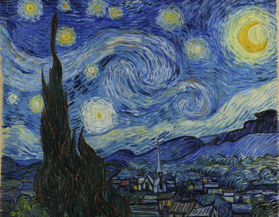

# Neural-Style-Transfer

Implement Neural Style Transfer Using Pytorch

# Requirments

* Pytorch 0.2.1
* torchvision 0.1.9
* Pillow 4.2.1
* Cuda (option)
* Cudnn (option)

# Experiments

<table>
    <tr>
        <th>Content</th>
        <th>Style</th>
        <th>Generate</th>
    </tr>
    <tr>
        <td></td>
        <td></td>
        <td></td>
    </tr>
    <tr>
        <td></td>
        <td></td>
        <td></td>
    </tr>
    <tr>
        <td></td>
        <td></td>
        <td></td>
    </tr>
  </table>

  

# Acknowledgement

[A Neural Algorithm of Artistic Style](https://arxiv.org/abs/1508.06576)

[Pytorch Tutorial](http://pytorch.org/tutorials/advanced/neural_style_tutorial.html)
